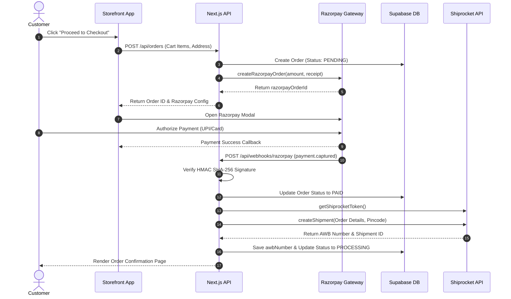
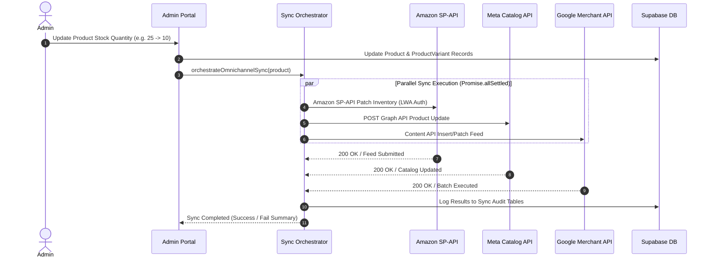

# Technical Architecture & Third-Party Integrations Specification

## Project: James & Sons High-End Luxury E-Commerce Platform

**Document Version:** 1.0.0  
**Date:** August 2026

---

## 1. Database Schema & Supabase RLS Policies

### 1.1 Core Entity Relational Diagram Summary

The system persistence layer uses PostgreSQL managed via Supabase and mapped using Prisma ORM.

```
┌─────────────────┐       ┌─────────────────┐       ┌─────────────────┐
│      User       │1     *│      Order      │1     *│    OrderItem    │
│─────────────────┼───────┼─────────────────┼───────┼─────────────────┤
│ id (UUID)       │       │ id (UUID)       │       │ id (UUID)       │
│ email           │       │ orderNumber     │       │ orderId (FK)    │
│ role (Role Enum)│       │ userId (FK)     │       │ productId (FK)  │
│ companyId (FK)  │       │ totalAmount     │       │ variantId (FK)  │
└────────┬────────┘       │ razorpayOrderId │       │ unitPrice       │
         │                │ trackingNumber  │       │ total           │
        1│                └────────┬────────┘       └─────────────────┘
         │                         │
         │                         │1
         ▼*                        ▼*
┌─────────────────┐       ┌─────────────────┐
│     Company     │       │  ReturnRequest  │
│─────────────────┤       │─────────────────┤
│ id (UUID)       │       │ id (UUID)       │
│ gstin           │       │ orderId (FK)    │
│ billingAddress  │       │ awbNumber       │
└─────────────────┘       └─────────────────┘

┌─────────────────┐       ┌─────────────────┐       ┌─────────────────┐
│    Category     │1     *│     Product     │1     *│ ProductVariant  │
│─────────────────┼───────┼─────────────────┼───────┼─────────────────┤
│ id (UUID)       │       │ id (UUID)       │       │ id (UUID)       │
│ slug (Unique)   │       │ sku (Unique)    │       │ productId (FK)  │
│ gstRate         │       │ categoryId (FK) │       │ sku (Unique)    │
│ hsnCode         │       │ mrp / d2cPrice  │       │ d2cPrice        │
└─────────────────┘       │ stockQuantity   │       │ stockQuantity   │
                          └─────────────────┘       └─────────────────┘
```

### 1.2 Database Tables & Schema Overview

#### Users & Corporate Governance

- `User`: Accounts for D2C customers, B2B buyers, B2B approvers, and system administrators. Contains role enum (`ADMIN`, `CUSTOMER`, `B2B_BUYER`, `B2B_APPROVER`), phone, last logged pincode, and optional link to `Company`.
- `Company`: B2B enterprise entities with GSTIN validation, corporate billing/shipping addresses, and self-referencing parent-subsidiary hierarchy (`parentId`).
- `UserAddress`: Saved customer shipping and billing address records.

#### Catalog Management

- `Category`: Hierarchical taxonomy (`parentId`), GST tax rates (default 18.0%), HSN codes, BIS standard certifications, and dynamic shipping limit overrides (`baseShippingLimit`, `freeShippingThreshold`).
- `Product`: Master catalog entity featuring SKU, slug, pricing tiers (`mrp`, `d2cPrice`, `b2bPrice`), technical specs (`isLed`, `luminousEfficacy`, `cri`, `bisCertification`), media arrays (`images`, `whiteBackgroundImages`, `glbModelUrl`), dimensions, weight, and platform-specific SEO metadata (Amazon fixture form, mounting type, bullet points).
- `ProductVariant`: SKU overrides for specific finishes, sizes, or wattages linked to parent `Product`.
- `Space`: Architectural curated spaces (e.g. Living Room, Villa Foyer, Bedroom) linked to products.

#### Orders & Fulfillment

- `Order`: Central transaction record linking `User`, total amounts, tax, discounts, applied `Coupon`, `Affiliate` code, payment gateway tokens (`razorpayOrderId`, `razorpayPaymentId`), shipping status (`OrderStatus`), shipment tracking (`awbNumber`, `trackingNumber`), and Amazon marketplace fields (`amazonOrderId`, `amazonShipmentFeedId`).
- `OrderItem`: Itemized order lines with SKU, unit price, quantity, and selected `Onsitego` warranty plans.
- `ReturnRequest`: Reverse logistics return requests tracking AWB numbers, Shiprocket shipment IDs, and return labels.

#### Procurement, Tickets & Marketing

- `RFQ` & `RFQItem`: B2B quote request system tracking custom specifications, target prices, admin approved prices, and conversion to `Order`.
- `Ticket`, `TicketMessage`, `TicketAuditLog`: Enterprise support ticket system with two-way Zoho Desk synchronization.
- `Coupon`, `CouponUsage`, `Affiliate`, `AffiliateConversion`: Promotion engine supporting percentage, fixed amount, and free shipping coupons with lifetime affiliate revenue tracking.
- `Campaign`, `DynamicCoupon`, `IndianHoliday`: Automated holiday marketing engine generating dynamic single-use discount codes (`DIWALI8X`).

---

### 1.3 Supabase Row-Level Security (RLS) Policies

Supabase tables enforce strict RLS rules at the database level:

```sql
-- Enable Row Level Security on Core Tables
ALTER TABLE "Product" ENABLE ROW LEVEL SECURITY;
ALTER TABLE "Order" ENABLE ROW LEVEL SECURITY;
ALTER TABLE "RFQ" ENABLE ROW LEVEL SECURITY;
ALTER TABLE "UserAddress" ENABLE ROW LEVEL SECURITY;

-- 1. Public Read Access for Products & Categories
CREATE POLICY "Allow public read access to active products"
ON "Product" FOR SELECT
USING (true);

-- 2. Authenticated Customer Access to Own Orders
CREATE POLICY "Users can view their own orders"
ON "Order" FOR SELECT
TO authenticated
USING (auth.uid()::text = "userId");

-- 3. Authenticated Customer Access to Own Addresses
CREATE POLICY "Users can manage their own addresses"
ON "UserAddress" FOR ALL
TO authenticated
USING (auth.uid()::text = "userId")
WITH CHECK (auth.uid()::text = "userId");

-- 4. Admin Master Access Policy
CREATE POLICY "Admins have full access to all tables"
ON "Order" FOR ALL
TO authenticated
USING (
  EXISTS (
    SELECT 1 FROM "User"
    WHERE "User".id = auth.uid()::text
    AND "User".role = 'ADMIN'
  )
);
```

---

## 2. Custom Image Editor Panel (`ProductImageEditor.tsx`)

### 2.1 Architecture Overview

The `ProductImageEditor` component in `@james-andsons/media` provides a browser-native 2D HTML5 canvas image studio embedded in the Admin Portal. It enables non-technical content managers to edit, enhance, transform, watermark, and generate studio-grade white-background images without external desktop software.

```
┌─────────────────────────────────────────────────────────────────────────────┐
│                       PRODUCT IMAGE EDITOR CANVAS                           │
│                                                                             │
│  ┌───────────────────────┐   ┌───────────────────┐   ┌───────────────────┐  │
│  │   Image Input (URL)   │──►│ 2D Canvas Engine  │──►│ Auto-Enhance      │  │
│  └───────────────────────┘   └─────────┬─────────┘   │ (Luminosity Grid) │  │
│                                        │             └───────────────────┘  │
│                                        ▼                                    │
│                              ┌───────────────────┐                          │
│                              │ Transformations   │                          │
│                              │ - Aspect Crop     │                          │
│                              │ - 90° Rotation    │                          │
│                              │ - Contrast/Filter │                          │
│                              │ - Text Watermark  │                          │
│                              └─────────┬─────────┘                          │
│                                        │                                    │
└────────────────────────────────────────┼────────────────────────────────────┘
                                         │
                                         ▼
┌─────────────────────────────────────────────────────────────────────────────┐
│                             CLOUDINARY PIPELINE                             │
│  ┌──────────────────────┐    ┌────────────────────┐    ┌─────────────────┐  │
│  │ Canvas.toBlob() WebP │───►│ Direct API Upload  │───►│ Optimized URL   │  │
│  │                      │    │ (ml_default)       │    │ Delivery        │  │
│  └──────────────────────┘    └────────────────────┘    └─────────────────┘  │
└─────────────────────────────────────────────────────────────────────────────┘
```

### 2.2 Auto-Enhance Luminosity Algorithm

The editor features an automated image analysis function `runAutoEnhance(imgElement)`:

1. **Histogram Sampling**: Renders image onto an offscreen 100×100 sample canvas (`10,000` pixels).
2. **Luminance Calculation**: Iterates over RGBA values calculating perceptual luminosity:
   $$\text{Luminance} = 0.299R + 0.587G + 0.114B$$
3. **Contrast Calculation**: Computes minimum, maximum, and average luminosity across the grid.
4. **Dynamic Adjustment**:
   - If average luminance is low ($< 100$), exposure brightness is boosted by $+15\%$.
   - If contrast spread ($\text{maxL} - \text{minL}$) is flat ($< 120$), contrast scale is increased by $+20\%$.
   - Color saturation is optimized by $+10\%$ to accentuate warm metallic/gold light fixture finishes.

### 2.3 Canvas Manipulation & Cloudinary Workflow

- **Cropping**: Supports fixed ratio presets (`1:1 Square`, `4:3 Standard`, `16:9 Banner`, `Original`).
- **White Background Generation**: Inverts transparent png layers into solid studio `#FFFFFF` RGB fills to comply with Amazon & Google Merchant image listing policies.
- **Export & Upload Workflow**:
  ```typescript
  // 1. Convert Canvas to Blob
  canvas.toBlob(
    async (blob) => {
      if (!blob) return;

      // 2. Prepare Multipart Form Data
      const formData = new FormData();
      formData.append("file", blob, "studio-product.webp");
      formData.append(
        "upload_preset",
        process.env.NEXT_PUBLIC_CLOUDINARY_UPLOAD_PRESET!,
      );

      // 3. Upload to Cloudinary Unsigned Endpoint
      const res = await fetch(
        `https://api.cloudinary.com/v1_1/${cloudName}/image/upload`,
        { method: "POST", body: formData },
      );
      const data = await res.json();

      // 4. Return Transformation Injected URL (e.g. f_auto, q_auto, w_800)
      const optimizedUrl = getOptimizedCloudinaryUrl(data.secure_url, {
        width: 800,
      });
    },
    "image/webp",
    0.92,
  );
  ```

---

## 3. Third-Party API & Webhook Specifications

### 3.1 Webhook Catalog

| Webhook / API Endpoint            | Source          | Secret Header Validation              | Event Types Processed                                                   |
| :-------------------------------- | :-------------- | :------------------------------------ | :---------------------------------------------------------------------- |
| `/api/webhooks/razorpay`          | Razorpay        | HMAC SHA-256 (`x-razorpay-signature`) | `payment.captured`, `payment.failed`, `order.paid`, `refund.processed`  |
| `/api/webhooks/logistics`         | Shiprocket      | Token (`x-shiprocket-token`)          | `AWB_ASSIGNED`, `PICKUP_SCHEDULED`, `SHIPPED`, `DELIVERED`, `CANCELED`  |
| `/api/webhooks/inventory-sync`    | Internal / Cron | Secret (`x-sync-secret`)              | `inventory.update`, `catalog.sync_all`, `stock.reconcile`               |
| `/api/webhooks/amazon`            | Amazon SP-API   | AWS SigV4 / LWA Token                 | `ORDER_CHANGE`, `INVENTORY_AVAILABILITY_CHANGE`                         |
| `/api/verify-gstin`               | Internal / UI   | Public / App Session                  | Validates GSTIN structure, Modulus-36 checksum, State & PAN             |
| `/api/accounting/export`          | Admin Portal    | Admin Session                         | Streams Excel (.xlsx 4-sheet package) & CSV statements by date range    |
| `/api/accounting/auto-gst-filing` | GitHub Cron     | Bearer (`CRON_SECRET`)                | Auto-emails monthly GSTR-1 Excel packages to `accounts@jamesandsons.in` |
| `/api/blog/import-docx`           | Admin Portal    | Admin Session                         | Parses Word .docx manuscripts to markdown blog posts                    |

### 3.2 Webhook Failure Handling & Idempotency

- **Idempotency Verification**: Every webhook payload includes a unique event ID or order transaction ID (`razorpayPaymentId`, `awbNumber`, `externalMessageId`). The handler checks existing table unique constraints before mutating records.
- **Retry Policy & Backoff**: If an endpoint returns HTTP `5xx` or encounters database lock errors, Razorpay and Shiprocket automatically retry delivery up to 5 times using exponential backoff (15s, 1m, 15m, 1h, 6h).
- **Audit Logging**: Failed webhook executions log error details to `fulfillmentError` in the `Order` or `ReturnRequest` tables for administrative review.

---

## 4. Data Flow Sequence Diagrams & Protocols

### Flow 1: Customer Checkout -> Razorpay -> Order -> Shiprocket Push



---

### Flow 2: Inventory Update -> Omnichannel Marketplace Sync


